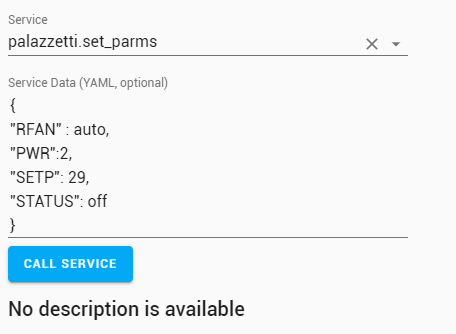

# Custom component Palazzetti for Home assistant 
A Home Assistant component for manage your Palazzetti stove

## Installation
Create directory `custom_components` in your home assistant configs directory is not exist
Copy the `palazzetti` directory and its contents to your directory `custom_components`

It should look similar to this after installation:
```
.homeassistant/
|-- custom_components/
|   |-- palazzetti/
|       |-- __init__.py
|       |-- manifest.json
```

## Configuration
Declare the component `palazzetti` in your configuration.yaml file.
Follow the sample below

ip = Ip of your Cbox

### Configuration `configuration.yaml`
```yaml
palazzetti:
  ip: 192.168.1.1    
```

## Parameters
| name       | type      | mandatory | description |
|:-----------|:----------|:----------|:------------|
| `ip`       | str       | yes       | local ip of your cbox |

## Switch and Level
Get a switch for start / stop your stove and slide for change the fire level or fan level
Follow the sample below
Don't miss to use the automation sample more below for set the link between the switch and the stove

</a>

### Configuration `configuration.yaml`
```yaml
#############################################
#                 Switch                    #
#############################################
switch:
  - platform: template
    switches:
      #############################################
      #                 palazzetti                #
      #############################################
      # State
      stove_status:
        friendly_name: "État"        
        value_template: "{{ state_attr('palazzetti.stove', 'STATUS') | int > 0 and state_attr('palazzetti.stove', 'STATUS') | int != 10 }}"
        turn_on:
          service: palazzetti.set_parms
          data:
            STATUS: 'on'
        turn_off:
          service: palazzetti.set_parms
          data:
            STATUS: 'off'
        icon_template: >-
          
            mdi:fireplace
          
            mdi:fireplace-off
            

input_number:
  # Fan level
  stove_fan_lvl:
    name: "Ventilation"
    min: 0
    max: 7
    step: 1
    icon : mdi:fan

          
  #Fire level
  stove_fire_lvl:
    name: "Puissance"
    initial: 1
    min: 1
    max: 5
    step: 1
    icon: mdi:fire
```


### Service
You can set some parameters through the service `palazzetti.set_parms`
</a>

### Automation `automation.yaml`
```yaml
- id: '1'
  alias: Check pwr state
  trigger:
    platform: state
    entity_id: palazzetti.stove
  action:
  - service: input_text.set_value    
    data_template:
      entity_id: input_text.text_test # don't miss to create a input_text "text_test" for test this script
      value: "{{ state_attr('palazzetti.stove', 'PWR') }}"

- id: '2'
  alias: Stove Fan State change
  trigger:
    platform: state
    entity_id: input_number.stove_fan_lvl
  action:
    service: palazzetti.set_parms
    data_template:
      RFAN: "{{ states('input_number.stove_fan_lvl') | int }}"

- id: '3'
  alias: Stove Fan State change
  trigger:
    platform: state
    entity_id: input_number.stove_fire_lvl
  action:
    service: palazzetti.set_parms
    data_template:
      PWR: "{{ states('input_number.stove_fire_lvl') | int }}"
```

### Sensor
</a>
```yaml
    #############################################
    #                 palazzetti                #
    #############################################
    stove_temperature:
      friendly_name: Temperature Poele
      value_template: "{{ state_attr('palazzetti.stove', 'T1') | float }}"
      icon_template: mdi:thermometer
      unit_of_measurement: °C
```


### Template
```yaml
    data_template:
      entity_id: input_text.text_test
      value: "{{ state_attr('palazzetti.stove', 'PWR') }}"
```

### Script
```yaml
'1': # set Fan Room
  alias: Test - set FAN Room
  sequence:  
  - service: palazzetti.set_parms    
    data:
      RFAN: 3

'2': # set fire power
  alias: Test - set fire Power
  sequence:  
  - service: palazzetti.set_parms    
    data:
      PWR: 3

'3': # start or stop
  alias: Test - Start stove
  sequence:  
  - service: palazzetti.set_parms    
    data:
      STATUS: ON
```

## Data Parameters
Here all parameters that can be changed

| name       | type      | possible values             | description 			 |
|:-----------|:----------|:----------------------------|:------------------------|
| `SETP`     | int       |                             | temperature target 	 |
| `PWR`      | int       |  1 to 5                     | fire power 			 |
| `RFAN`     | int & str |  off / 1 to 5 / auto / high | level of room fan 		 |
| `STATUS`   | str       |  on / off                   | start or stop the stove |

## Other
### Note
This component is tested only on Stove `NINA 6kW` not ductable. Don't hesitate to signal any trouble
I know some difference for other stove that have the option ductable

### Coming soon
- [ ] fix for ductable stove
- [ ] named vars for PWR / RFAN / SETP
- [ ] link with `climate` entity
- [ ] may be an updater for check new release of component

#### DEV - enable log
Enable home-assistant logger in your `configuration.yaml`
```yaml
logger:
  default: error  
  logs:    
    custom_components.palazzetti: debug
```

### Tested on release
```
  0.100.3
  0.108.0
```
