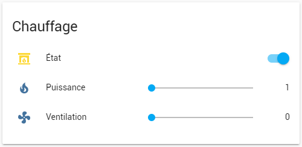
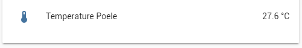

# Custom component Palazzetti for Home assistant 
A Home Assistant component for manage your Palazzetti stove
Note :
- the status and counters of stove is updated directly when home assistant start
- since 23 decembre 2020 counters is updated each 10 minutes and stove status like temperature each 30 secondes or when something is updated through calling "set_parms" service

## Installation
Create directory `custom_components` in your home assistant configs directory is not exist
Copy the `palazzetti` directory and its contents to your directory `custom_components`

It should look similar to this after installation:
```
.homeassistant/
|-- custom_components/
|   |-- palazzetti/
|       |-- __init__.py
|       |-- manifest.json
```

### Secrets `secrets.yaml`
```yaml
ip_palazzetti_connectionbox: 192.168.1.1 # TODO mettre l'IP de votre connection Box
```
## Parameters
| name       | type      | mandatory | description |
|:-----------|:----------|:----------|:------------|
| `ip`       | str       | yes       | local ip of your cbox |

## Switch and Level
Get a switch for start / stop your stove and slide for change the fire level or fan level
Follow the sample below
Don't miss to use the automation sample more below for set the link between the switch and the stove

</a>

### Configuration `configuration.yaml`
```yaml
############ palazzetti ############
palazzetti:
  ip: !secret ip_palazzetti_connectionbox

input_text:
  text_test:
    name: Text Test

input_number:
  #Fan level
  stove_fan_lvl:
    name: "Ventilation"
    min: 0
    max: 7
    step: 1
    icon: mdi:fan

  #Fire level
  stove_fire_lvl:
    name: "Puissance"
    initial: 1
    min: 1
    max: 5
    step: 1
    icon: mdi:fire

switch:
  - platform: template
    switches:
      stove_status:
        friendly_name: "État"
        value_template: "{{ state_attr('palazzetti.stove', 'STATUS') | int > 0 and state_attr('palazzetti.stove', 'STATUS') | int != 10 }}"
        turn_on:
          service: palazzetti.set_parms
          data:
            STATUS: "on"
        turn_off:
          service: palazzetti.set_parms
          data:
            STATUS: "off"
        icon_template: >-
          
            mdi:fireplace
          
            mdi:fireplace-off
          

############ fin palazzetti ############
# les derniers includes
automation: !include automations.yaml
script: !include scripts.yaml
scene: !include scenes.yaml
sensor: !include sensors.yaml

logger:
  default: error
  logs:
    custom_components.palazzetti: error # error debug
```

### Automation `automations.yaml`
```yaml
- id: '1'
  alias: Check pwr state
  trigger:
    platform: state
    entity_id: palazzetti.stove
  action:
  - service: input_text.set_value
    data_template:
      entity_id: input_text.text_test
      value: '{{ state_attr(''palazzetti.stove'', ''PWR'') }}'
- id: '2'
  alias: Stove Fan State change
  trigger:
    platform: state
    entity_id: input_number.stove_fan_lvl
  action:
    service: palazzetti.set_parms
    data_template:
      RFAN: '{{ states(''input_number.stove_fan_lvl'') | int }}'
- id: '3'
  alias: Stove Fire State change
  trigger:
    platform: state
    entity_id: input_number.stove_fire_lvl
  action:
    service: palazzetti.set_parms
    data_template:
      PWR: '{{ states(''input_number.stove_fire_lvl'') | int }}'
- id: '4'
  alias: Stove Fan State check
  trigger:
    platform: state
    entity_id: palazzetti.f2l
  action:
    service: input_number.set_value
    data:
      entity_id: input_number.stove_fan_lvl
      value: '{{ states(''palazzetti.f2l'') }}'
- id: '5'
  alias: Stove Fire State check
  trigger:
    platform: state
    entity_id: palazzetti.pwr
  action:
    service: input_number.set_value
    data:
      entity_id: input_number.stove_fire_lvl
      value: '{{ states(''palazzetti.pwr'') }}'
```

### Sensor sensors.yaml
</a>
```yaml
#############################################
#                 palazzetti                #
#############################################
- platform: template
  sensors:
    stove_temperature_piece:
      friendly_name: Temperature Pièce
      value_template: "{{ state_attr('palazzetti.stove', 'T1') | float }}"
      icon_template: mdi:thermometer
      unit_of_measurement: °C

- platform: template
  sensors:
    stove_temperature_granules:
      friendly_name: Temperature granulés
      value_template: "{{ state_attr('palazzetti.stove', 'T2') | float }}"
      icon_template: mdi:thermometer
      unit_of_measurement: °C

- platform: template
  sensors:
    stove_temperature_fumee_combustion:
      friendly_name: Temperature fumée conbustion
      value_template: "{{ state_attr('palazzetti.stove', 'T3') | float }}"
      icon_template: mdi:thermometer
      unit_of_measurement: °C

- platform: template
  sensors:
    stove_temperature_t4:
      friendly_name: Temperature T4
      value_template: "{{ state_attr('palazzetti.stove', 'T4') | float }}"
      icon_template: mdi:thermometer
      unit_of_measurement: °C

- platform: template
  sensors:
    stove_temperature_ballon:
      friendly_name: Temperature Ballon
      value_template: "{{ state_attr('palazzetti.stove', 'T5') | float }}"
      icon_template: mdi:thermometer
      unit_of_measurement: °C

- platform: template
  sensors:
    stove_conso_pellets:
      friendly_name: Consommation Pellets
      value_template: "{{ state_attr('palazzetti.stove', 'PQT') | int }}"
      icon_template: mdi:counter
      unit_of_measurement: Kg

```

### Script scripts.yaml
```yaml
"palazzetti_set_fan_3": # set Fan Room
  alias: set FAN 3
  sequence:
    - service: palazzetti.set_parms
      data:
        RFAN: 3

"palazzetti_set_pwr_2": # set fire power
  alias: set Power 2
  sequence:
    - service: palazzetti.set_parms
      data:
        PWR: 2

"palazzetti_set_status_on": # start
  alias: Start stove
  sequence:
    - service: palazzetti.set_parms
      data:
        STATUS: ON

"palazzetti_set_status_on_night": # start Night
  alias: Start stove Night
  sequence:
    - service: palazzetti.set_parms
      data:
        STATUS: ON
        PWR: 1
        RFAN: 1

"palazzetti_set_status_off": # stop
  alias: Stop stove
  sequence:
    - service: palazzetti.set_parms
      data:
        STATUS: OFF
```

## Data Parameters
Here all parameters that can be changed

| name       | type      | possible values             | description 			 |
|:-----------|:----------|:----------------------------|:------------------------|
| `SETP`     | int       |                             | temperature target 	 |
| `PWR`      | int       |  1 to 5                     | fire power 			 |
| `RFAN`     | int & str |  off / 1 to 5 / auto / high | level of room fan 		 |
| `STATUS`   | str       |  on / off                   | start or stop the stove |

## Other
### Note
This component is tested only on Stove `NINA 6kW` not ductable. Don't hesitate to signal any trouble
I know some difference for other stove that have the option ductable

### List of stove tested 
- Ecofire Julie 12 Pro 3 air ( @RonandoDeLaVega )
- Ecofire Ines 9kw air ( @jere19 )
- Ecofire Giorgia 12 PRO 3 ACCIAIO NERO (@meyxiam)

you can contribute to this list ( see and update this post - https://github.com/Vost3/hass-palazzetti/issues/13 )


### Coming soon
- [ ] fix for ductable stove
- [ ] named vars for PWR / RFAN / SETP
- [ ] link with `climate` entity

#### DEV - enable log
Enable home-assistant logger in your `configuration.yaml`
```yaml
logger:
  default: error  
  logs:    
    custom_components.palazzetti: debug
```

### Tested on release
```
  0.100.3
  0.108.0
  2020.12.1
  2023.3.6
  2023.12.4
```
